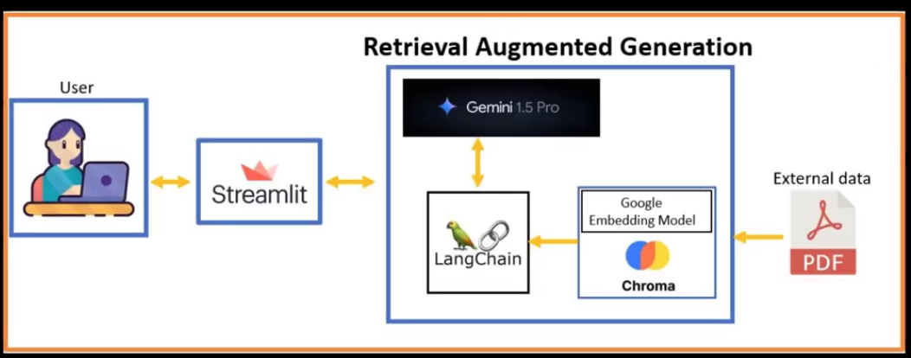
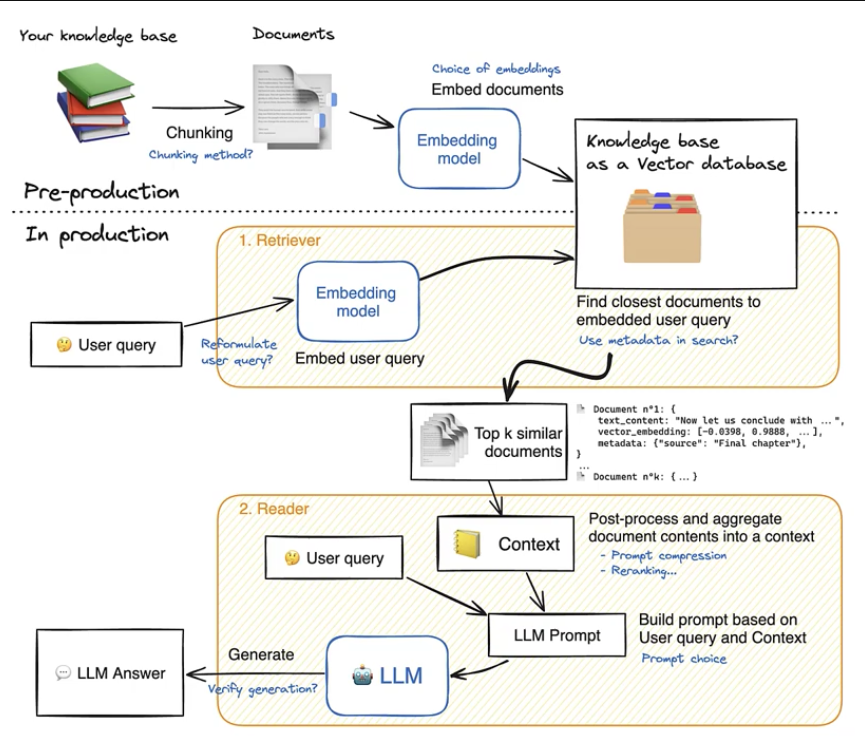

# Retrieval Augmented Generation (RAG) using Gemini Pro

## Environment setup:

    	conda create -n env_ragGemini python=3.13
    	conda activate env_ragGemini
    	python -m pip install --upgrade pip
    	Install packages:
    	pip install -r requirements.txt

## Run App:

    	streamlit run app1.py

